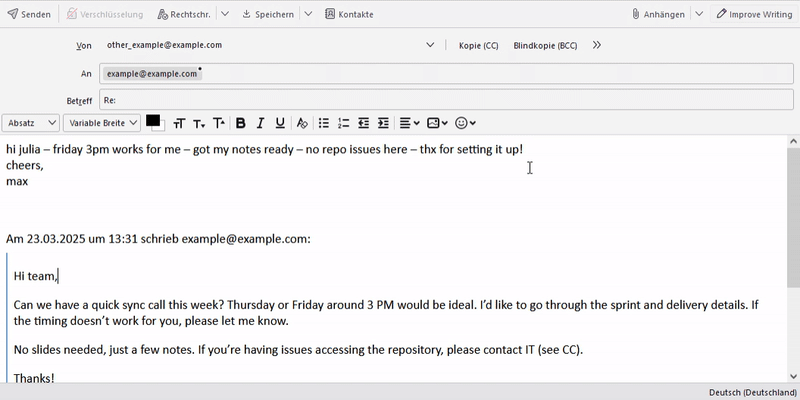

# AI Writing Assistant for Thunderbird

A Thunderbird extension that helps improve your email writing using various AI models (LLMs) and customizable prompts. This extension can enhance your email's writing style, tone, and formatting while maintaining the original message.

## ✨ Features

### Multiple AI Models Support

| **OpenAI Models** | **Groq Models**         | **Google Models** |
| ----------------- | ----------------------- | ----------------- |
| GPT-4 Turbo       | Llama 3.3 70B Versatile | Gemini 2.0 Flash  |
| GPT-4 Turbo Mini  | Llama 3.2 3B Preview    |                   |
| GPT-3.5 Turbo     |                         |                   |

API keys for at least one model are required to use the extension. You can obtain API keys from the respective AI service providers.

### Customizable Settings

- **Temperature Control**: Adjust the creativity level (0-2)
  - Lower values (0-1): More focused and deterministic responses
  - Higher values (1-2): More creative and diverse responses
- **Max Tokens**: Control the maximum length of AI responses (1-4000)
- **Custom Prompts**: Set your own prompt for email improvement
- **Model Selection**: Choose your preferred AI model

Settings can be accessed from the Thunderbird add-ons list.

### Privacy & Transparency

- Your email content is only sent to the AI service when you click the improve button. Keep in mind that the AI service may handle and store your data according to their privacy policy.
- No data is stored locally except for your settings
- API keys are stored securely in your browser's local storage.
- The extension is **open-source** and kept **simple for transparency**. You can review the code and contribute to the project.

## 🚀 Installation

1. Download the extension zib file from the releases page.
2. In Thunderbird, go to **Tools > Add-ons**
3. Click the gear icon > _Install Add-on From File_
4. Choose the downloaded file

### First-Time Setup

1. When you first install the extension, it will automatically open the settings page
2. Enter your API key for your chosen AI model
3. Configure your preferred settings:
   - Select your AI model
   - Set temperature (0-2)
   - Set max tokens (1-4000)
   - Customize the improvement prompt

### Usage

1. Draft a new email in Thunderbird
2. Click the "Improve Writing" button in the compose window
3. Wait for the AI to process your email
4. The improved version will replace your original draft - without messing up conversation history.

## ✅ Requirements

- Thunderbird 78.0+
- API key from a supported AI provider
- Internet connection

## 🛠️ Troubleshooting

- Double-check your API key
- Ensure internet access
- Use a supported Thunderbird version
- Read error messages for hints

## 🤝 Contributing

We welcome bug reports and pull requests! See our [CONTRIBUTING.md](CONTRIBUTING.md) for more details.

## License

This project is licensed under the [Apache License 2.0](LICENSE) - see the [LICENSE](LICENSE) file for details.

Icons adapted from [pepicons](https://github.com/CyCraft/pepicons/) (CC BY 4.0).
