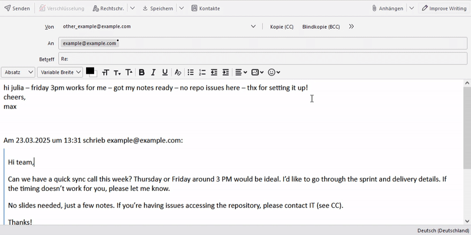

# AI Writing Assistant for Thunderbird

A Thunderbird extension that helps improve your email writing using various AI models (LLMs) and customizable prompts. This extension can enhance your email's writing style, tone, and formatting while maintaining the original message.

## ✨ Features



### Multiple AI Providers

| Provider | Notes |
| -------- | ----- |
| **OpenAI** | GPT-6 Astra, GPT-5.6 Sol / Terra / Luna |
| **Groq** | GPT-OSS 20B/120B, Llama 3.3 70B, Llama 3.1 8B |
| **Google** | Gemini 3.8 / 3.7 / 3.5 Flash, Flash Lite |
| **OpenRouter** | One API key for hundreds of models from every major lab |
| **Ollama** (self-hosted) | Any locally installed model (\*) |
| **Custom** | Any OpenAI-compatible endpoint (company gateway, LM Studio, vLLM, ...) |

API keys are required for the hosted providers, and are stored per provider -
switching providers does not make you re-enter a key. You can obtain API keys
from the respective AI service providers.

(\*) Requires to set 'OLLAMA_ORIGINS "moz-extension://*" as described [here (github.com)](https://github.com/ollama/ollama/blob/main/docs/faq.md#how-can-i-allow-additional-web-origins-to-access-ollama).

### Configurable Model List

Providers and models are not hard-coded. They live in
[`config/models.json`](config/models.json), and you can replace that list with
your own from _Settings > Model Configuration (advanced)_ - paste JSON, import
a file, or reset back to the bundled defaults.

A provider entry looks like this:

```json
{
  "id": "openrouter",
  "label": "OpenRouter",
  "api": "openai",
  "endpoint": "https://openrouter.ai/api/v1/chat/completions",
  "apiKey": "required",
  "modelsUrl": "https://openrouter.ai/api/v1/models",
  "models": [{ "id": "openai/gpt-6-astra", "label": "GPT-6 Astra" }]
}
```

| Field | Meaning |
| ----- | ------- |
| `id` | Short identifier, used to store the key for this provider. Must not contain `:`. |
| `api` | Request format: `openai` (chat completions), `google` (Gemini) or `ollama`. |
| `endpoint` | Request URL. `{model}` is replaced with the model id (used by Gemini). |
| `endpointEditable` | Lets the endpoint be edited in the settings page. |
| `apiKey` | `required`, `optional` or `none`. |
| `apiKeyUrl` | Optional link to where the provider hands out keys. |
| `modelsUrl` | Optional. Enables the "Refresh list" button to pull the live model list. |
| `maxTokensParam` | Token limit field name, `max_tokens` by default. |
| `headers` | Extra request headers. |
| `models` | `{ "id", "label" }` entries. Set `"supportsTemperature": false` for models that reject a custom temperature. |

Any model id the provider accepts can also be typed straight into the settings
page via _Other - enter a model ID…_, without touching the configuration.

The bundled lists are a starting point, not a complete catalog. Groq,
OpenRouter and Ollama can pull their full live list with the "Refresh list"
button; for OpenAI and Google, edit the configuration or type the model id.

Adding a provider on a new domain also needs its host in the `permissions`
array of `manifest.json`; self-hosted endpoints work when the server allows the
`moz-extension://` origin.

### Customizable Settings

- **Model Selection**: Choose your preferred provider and AI model
- **Custom Prompts**: Set your own prompt for email improvement
- **Temperature Control**: Adjust the creativity level (0-2)
  - Lower values (0-1): More focused and deterministic responses
  - Higher values (1-2): More creative and diverse responses
  - Some reasoning models reject a custom temperature; it is omitted for those
    and the settings page says so
- **Max Tokens**: Control the maximum length of AI responses (1-4000)

Settings can be accessed from the Thunderbird add-ons list.

### Privacy & Transparency

- Your email content is only sent to the AI service when you click the "Improve Writing" button. Keep in mind that the AI service may handle and store your data according to their privacy policy. If your hardware supports it, **use self-hosted models for better privacy**.
- No data is stored locally except for your settings
- API keys are stored securely in your browser's local storage.
- The extension is **open-source** and kept **simple for transparency**. You can review the code and contribute to the project.

## 🚀 Installation

1. Download the extension '.zib' file from the releases page.
2. In Thunderbird, go to _Tools > Add-ons_
3. Click the gear icon > _Install Add-on From File_
4. Choose the downloaded file

### First-Time Setup

1. When you first install the extension, it will automatically open the settings page
2. Pick a provider and enter your API key for it
3. Configure your preferred settings:
   - Select your AI model
   - Set temperature (0-2)
   - Set max tokens (1-4000)
   - Customize the improvement prompt

### Usage

1. Draft a new email in Thunderbird
2. Click the "Improve Writing" button in the compose window
3. Wait for the AI to process your email
4. The improved version will replace your original draft - without messing up conversation history.

## ✅ Requirements

- Thunderbird 78.0+
- API key from a supported AI provider
- Internet connection

## 🛠️ Troubleshooting

- Double-check your API key
- Ensure internet access
- Use a supported Thunderbird version
- Read error messages for hints

## 🤝 Contributing

We welcome bug reports and pull requests! See our [CONTRIBUTING.md](CONTRIBUTING.md) for more details.

## License

This project is licensed under the [Apache License 2.0](LICENSE) - see the [LICENSE](LICENSE) file for details.

Icons adapted from [pepicons](https://github.com/CyCraft/pepicons/) (CC BY 4.0).
